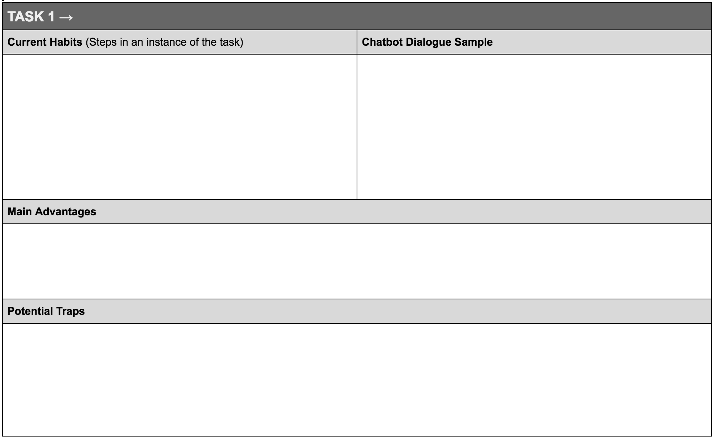

# 1-4 Task Analysis

## 1-4 Task Analysis

## Objective

Analyze how people currently \(without your bot\) complete tasks and achieve the same goals. This will inform your design decisions in several ways.

> **Understanding the current habits of people will...**
>
> * help you design an easy entry into using your bot so it feels natural and consistent with people's mental model of the topic.
> * reveal opportunities to design noticeable advantages for your bot over current practices. You need to "sell" the experience in a way. Does it save time? Make it more fun? Provide better value?
> * identify paths that you may want to avoid in your bot. You don't want to mimic any bad experiences people may have on the topic.

### Instructions

**Snapshot of Task Analysis Template**

1. **Determine the top 3 tasks that your bot will perform.** Be sure to identify the primary goal for each of those tasks. This may change later as you develop your project, but you need to start with a clear direction to make progress.
2. **For each task, list the detailed steps people currently use to reach the task goal using a specific instance.** In other words, how do people complete this task without your bot? Label the steps the user performs and any steps completed by a computer program \(or other tool\). Start with your best guess. **But for each task, ask 3 people how they would complete it** and use your findings to adjust the steps for a particular instance.

   > #### For example, if one bot task will be to "Find Burrito Recipes by Ingredients or Taste", use a specific instance like the following.
   >
   > **TASK: Jill wants a burrito recipe that incorporates chorizo as an ingredient.**
   >
   > * Jill: Opens browser.
   > * Jill: Enters "chorizo burrito recipes" in the search bar.
   > * COMPUTER: Google returns a list of sites having burrito recipes \(with 2 ads at the top\)
   > * Jill: Scans results and selects a page on allrecipes.com
   > * ...
   > * ...
   > * ...
   > * Jill: Returns to the browser tab from seriouseats.com and selects print from the browser menu.
   > * Computer: Prints recipe with all the other headings, menus, and ads on the web page.

3. **Look for the best opportunities to improve the steps in each task using your chatbot.** At the same time, be sure to consider how to avoid inserting any steps with your chatbot that would degrade the experience.
4. **Make an instance of a potential chatbot dialogue for the same tasks** that you believe improves the experience. Be detailed and consider how the chatbot will handle "directing" the conversation so that it is easy to follow and reduces the chance of getting lost in the conversation. Include labels for the person and chatbot in the example dialogue.
5. **After completing all three chatbot dialogues, review and compare the current way completing the task with your proposed chatbot concepts.** Refine the chatbot dialogues as needed.
6. **List the main advantages** you see in using the chatbot.
7. **List the potential traps** that could cause the chatbot to provide a poor experience for people.

[Task Analysis Template](https://docs.google.com/document/d/1FIdVp7UxEGEd2Gcs5KjhGjz0N-5To9Z_uucIxGXua1U/edit?usp=sharing)

### ✓ Deliverable

Submit your "Task Analysis". One per team, but with each team member contributing to the shared document.

