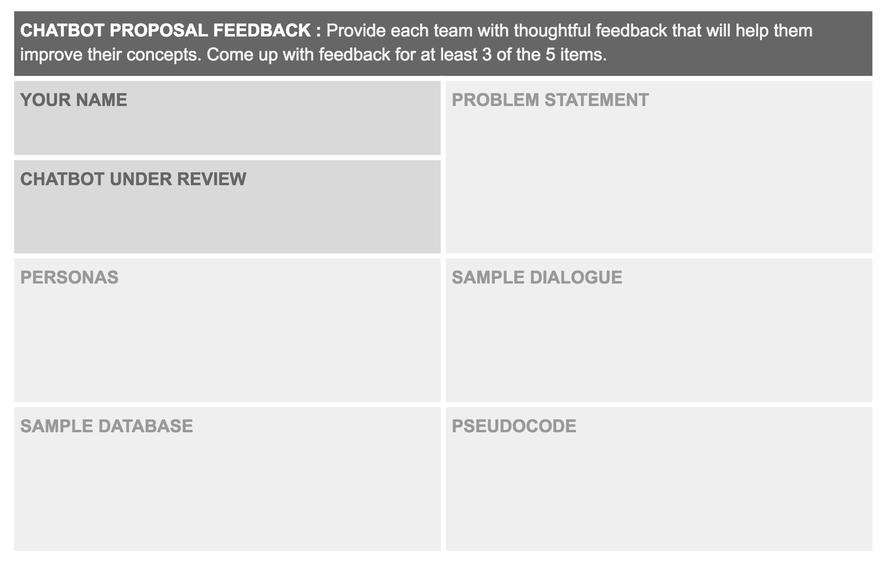

# 2-6 Present Team Proposal

## Objective

Collect your team's work into a slide set \(Google slides\) and present it to the class.

## Instructions

1. Prepare at least 7 slides.
   * Problem Statement
   * Personas \(3 slides\)
   * Sample Dialogue
   * Sample Database
   * Pseudocode Functions
2. Clearly label your content and make it legible for projection. 
3. Lead a thorough discussion and encourage thoughtfully feedback from your classmates, as classmates will be using the template below to document feedback. 

## ✓ Deliverables

1. Slides and Delivery of the Presentation: One per team.
2. Feedback Sheet: Each Student provides each team feedback.

[Feedback Sheet](https://docs.google.com/document/d/1g8B_3dd0GZl7_SBKxqKPBJO4NmrhjC1IEYUTd866jiA/edit?usp=sharing)

